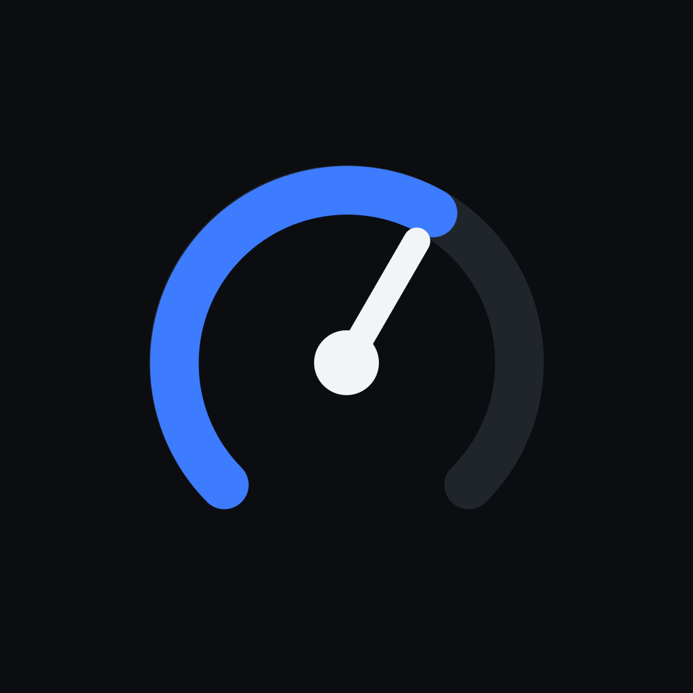
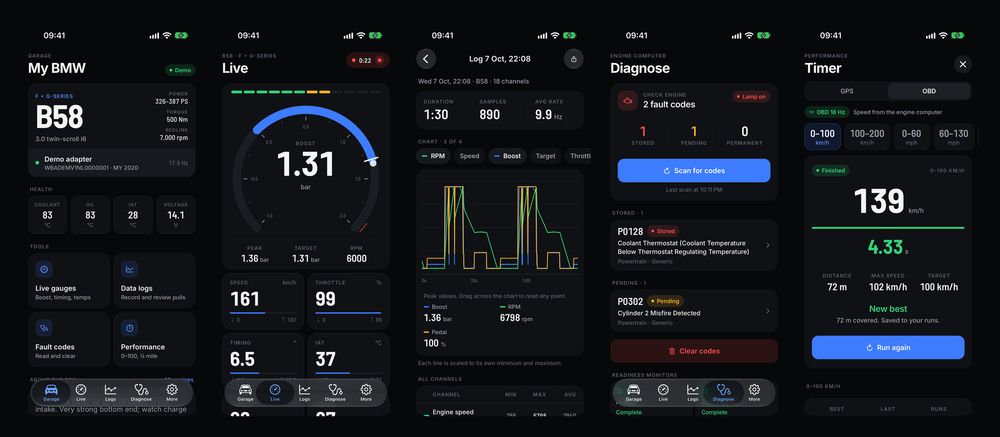

<p align="center">
  
</p>

<h1 align="center">OpenBimmer</h1>

<p align="center">
  Free and open-source live data, data logging and diagnostics for BMW turbo engines.<br/>
  iPhone and Android. One cheap Bluetooth LE OBD adapter. No account, no tracking.
</p>

<p align="center">
  <a href="https://github.com/openbimmer/openbimmer/actions/workflows/ci.yml"></a>
  <a href="LICENSE"></a>
  
</p>

<p align="center">
  
</p>

## Download

- Android: [latest APK](https://github.com/openbimmer/openbimmer/releases/latest) (Google Play listing in review)
- iPhone: App Store submission in progress
- Website: [openbimmer.github.io](https://openbimmer.github.io)

## Features

- **Live gauges.** A large radial gauge (boost by default) with peak hold and boost target marker, a shift light that follows your engine's redline, and eight configurable value tiles with min and max.
- **Data logs.** Record pulls with up to 34 channels, review them on a scrubbable multi-channel chart, see min, max and average per channel and export CSV that works with datazap.
- **Diagnose.** Read stored, pending and permanent engine fault codes with SAE descriptions, clear them, check readiness monitors, read the VIN and battery voltage.
- **Performance timer.** 0-100 km/h, 100-200 km/h, 0-60 mph, 60-130 mph, 1/8 and 1/4 mile with GPS or OBD speed, interpolated start and finish, history and best times.
- **Engine profiles** for N54, N55 (E and F series), B58, S55, N13, S58 and S63 that set gauge ranges, warning limits and the shift light.
- **Demo adapter.** A simulated ELM327 with a realistic engine model, so you can try every screen without a car.
- **Adapter console** with the raw ELM327 traffic for troubleshooting and bug reports.
- Metric and imperial units (km/h or mph, °C or °F, bar, psi or kPa, Nm or lb-ft, PS, hp or kW).

## Supported engines

| Engine | Series | Typical models |
| --- | --- | --- |
| N54 | E-Series | 135i, 335i, 535i, Z4 sDrive35i, 1M Coupé |
| N55 | E-Series | 135i, 335i (LCI), X5/X6 xDrive35i |
| N55 | F-Series | M135i, M235i, 335i, 435i, 535i, M2 |
| B58 | F + G-Series | M140i, M240i, 340i, M340i, 440i, 540i, 740i, Z4 M40i |
| S55 | F-Series | M3 (F80), M4 (F82/F83), M2 Competition/CS |
| N13 | F-Series | 114i, 116i, 118i, 316i |
| S58 | F + G-Series | M3 (G80), M4 (G82/G83), M2 (G87), X3 M, X4 M |
| S63 | F-Series | M5, M6, X5 M, X6 M, M8 |

All data comes from standardised OBD-II (SAE J1979), so other cars with an OBD-II port work too; the engine profile only changes ranges and limits.

## Adapter

Any ELM327-compatible adapter that uses **Bluetooth LE** (Bluetooth 4.0 or newer) works on both iPhone and Android, for example Vgate iCar Pro BLE 4.0, Veepeak OBDCheck BLE, vLinker BLE models or OBDLink CX. They cost 20 to 80 euros on Amazon.

Classic Bluetooth adapters (the cheap blue "ELM327 v1.5" boxes) cannot be used on iPhone because iOS does not give apps access to classic Bluetooth serial devices.

The OBD port is in the driver footwell, left of the steering column. Plug in the adapter, switch the ignition on and tap **Connect** in the Garage tab.

## Read-only by design

OpenBimmer reads data and, on request, clears engine fault codes (OBD-II service 04). It never writes software, calibrations or coding to the car. It is not an ECU flashing tool.

## How it works

```
Bluetooth LE  ->  ELM327 (AT commands, ISO 15765-4 CAN)  ->  engine computer (OBD-II services 01, 03, 04, 07, 09, 0A)
```

- `src/obd/ble-transport.ts` finds the adapter's serial characteristics automatically (FFF0, FFE0, 18F0 and vendor services, with a generic fallback).
- `src/obd/elm327.ts` is a command queue with prompt handling, timeouts, resync and error mapping.
- `src/obd/session.ts` initialises the adapter (protocol detection, supported PIDs, VIN), targets the engine computer directly (`ATSH7E0`) and polls only the channels on screen. It batches up to six PIDs per request and falls back to single requests on clones that cannot do that.
- `src/obd/frames.ts` assembles ISO-TP single, first and consecutive frames per ECU.
- `src/obd/pids.ts` decodes the PIDs and derives boost (PID 70 or 87 when available, otherwise MAP minus barometric pressure), AFR, and estimated torque and power from PIDs 62/63.
- `src/obd/demo-transport.ts` simulates an ELM327 and an engine for development and screenshots.

## Build from source

Requirements: [Bun](https://bun.sh), Xcode 26 or newer for iOS, Android Studio / JDK 17 for Android.

```sh
git clone https://github.com/openbimmer/openbimmer.git
cd openbimmer
bun install
bun run check          # typecheck and protocol self-tests
bunx expo run:ios      # or: bunx expo run:android
```

Bluetooth needs a development build; Expo Go does not include the BLE module. The iOS simulator has no Bluetooth, use the demo adapter there.

An Android APK is attached to every [release](https://github.com/openbimmer/openbimmer/releases). Store versions for Google Play and the App Store are in review.

## Project structure

```
src/app          screens (expo-router)
src/components   UI building blocks, gauges, charts
src/obd          adapter transports, ELM327 protocol, PIDs, fault codes, VIN
src/store        settings, logs and performance results (zustand)
src/data         engine profiles
scripts          self-tests and icon generation
```

## Contributing

Issues and pull requests are welcome. Good first contributions:

- Classic Bluetooth (SPP) support on Android and Wi-Fi adapters
- More engine profiles
- Translations

Please run `bun run check` before opening a pull request. UI conventions are in [docs/CONTRIBUTING-UI.md](docs/CONTRIBUTING-UI.md).

## Disclaimer

Use at your own risk. Never operate the app while driving and only run performance measurements on closed roads or tracks. Estimated torque and power are derived from values the engine computer reports and are not dyno results.

OpenBimmer is an independent community project and is not affiliated with BMW AG or any tuning company. BMW and the engine designations are trademarks of their respective owners and are used only to describe compatibility.

## License

[MIT](LICENSE)
